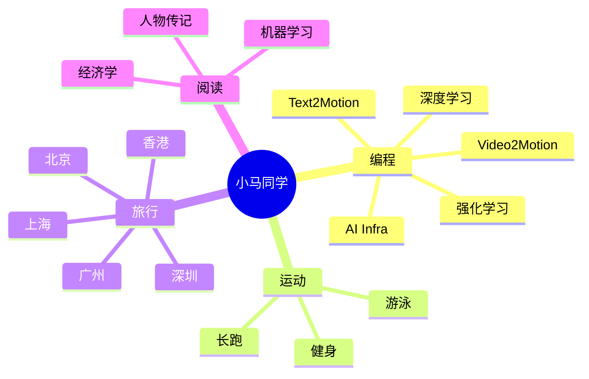

<div align="center">
  <!-- knock code pictures 敲代码的图片 -->
  <br>

  <!-- profile logo 个人资料徽标 -->
  <div align="center">
    <a href="https://twitter.com/xmg2023/"></a>&emsp;
    <a href="https://www.youtube.com/@xmg2023"></a>&emsp;
    <a href="https://space.bilibili.com/315558537/"></a>&emsp;
    <a href="https://blog.csdn.net/u013146882/"></a>&emsp;
    <a href="https://www.zhihu.com/people/xmg91/"></a>&emsp;
    <!-- visitor statistics logo 访客数统计徽标 -->
    
  </div>
</div>

#  🙋 Hello

<tr><td>

<!-- About me 关于我 -->
### 🤺 About Me
  
<p>&emsp;&emsp;大家好，我是小马同学。</p>
<p>&emsp;&emsp;热爱编程、电影、读书、运动和旅行。</p>
<p>&emsp;&emsp;热爱计算机科学和互联网事业，励志成为优秀的开源开发者。</p>
<p>&emsp;&emsp;我们正在让这个世界变得更加美好，通过代码来理解世界和改变世界。</p>

</td></tr>

<tr><td>

<!-- 近期博客 -->
### 📃 Recent Blog
  
<!-- START_SECTION:blog -->
* <a href='https://blog.csdn.net/u013146882/article/details/79265924' target='_blank'>JData数据处理及高潜用户购买意向预测 </a> - 2018-02-05
* <a href='https://blog.csdn.net/u013146882/article/details/77685123' target='_blank'>srand()和rand() </a> - 2017-08-29
<!-- END_SECTION:blog -->

</td></tr>

<tr><td>

### 🤾‍♂️ Funny Soul

<!-- START_SECTION:douban -->
* <a href='https://movie.douban.com/subject/36292415/' target='_blank'>最近在看《史前星球第二季》</a> 🌟🌟🌟🌟🌟 力荐- 2023-06-11
* <a href='https://book.douban.com/subject/30424330/' target='_blank'>最近在读《Go语言并发之道》</a> 🌟🌟🌟 推荐- 2023-06-10
* <a href='https://book.douban.com/subject/5403729/' target='_blank'>最近在读《三国志》</a> 🌟🌟🌟🌟🌟 力荐- 2023-06-10
* <a href='https://book.douban.com/subject/36094930/' target='_blank'>看过《史记》</a> 🌟🌟🌟🌟🌟 力荐- 2023-06-01
* <a href='https://book.douban.com/subject/26642310/' target='_blank'>看过《DOOM启示录》</a> 🌟🌟🌟🌟🌟 力荐- 2022-10-07
<!-- END_SECTION:douban -->

</td></tr>

<div align="center" >

<!-- 兴趣爱好统计 -->

🕹️ 兴趣爱好


  
<!--  skill badge 技能徽章 -->
💪 正在学习
  


  
🧠 计划学习
  


🧰 常用工具


<!--START_SECTION:waka-->

```txt
No activity tracked
```

<!--END_SECTION:waka-->

 [](https://github.com/xmg2024/github-readme-stats)
 


 
