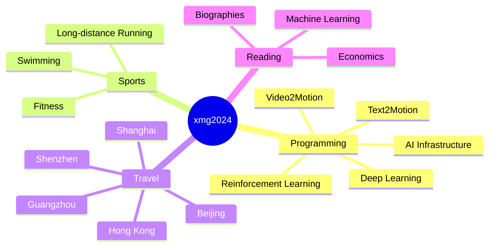

<div align="center">
  <!-- knock code pictures 敲代码的图片 -->
  <br>

  <!-- profile logo 个人资料徽标 -->
  <div align="center">
    <a href="https://twitter.com/xmg2023/"></a>&emsp;
    <a href="https://www.youtube.com/@xmg2023"></a>&emsp;
    <a href="https://space.bilibili.com/315558537/"></a>&emsp;
    <a href="https://blog.csdn.net/u013146882/"></a>&emsp;
    <a href="https://www.zhihu.com/people/xmg91/"></a>&emsp;
    <!-- visitor statistics logo 访客数统计徽标 -->
    
  </div>
</div>

#  🙋 Hello

<tr><td>

<!-- About me 关于我 -->
### 🤺 About Me
  
<p>&emsp;&emsp;Hello, everyone，I'm xmg2024. </p>
<p>&emsp;&emsp;Love programming, movies, reading, sports, and travel. </p>
<p>&emsp;&emsp;Love computer science and internet career, aspiring to become an excellent computer programmer. </p>
<p>&emsp;&emsp;We are making this world a better place, understanding and changing the world through code. </p>

</td></tr>

<tr><td>

### 🤾‍♂️ Funny Soul

<!-- START_SECTION:douban -->
* <a href='https://movie.douban.com/subject/36292415/' target='_blank'>Recently watching "The Cage Season 2"《灵笼第二季》 </a> 🌟🌟🌟🌟🌟 Highly recommend- 2025-07-12
* <a href='https://book.douban.com/subject/30424330/' target='_blank'>Recently reading "Dive into Deep Learning (Li Mu)"《动手学深度学习（李沐）》 </a> 🌟🌟🌟🌟🌟 Highly recommend- 2025-07-12
* <a href='https://book.douban.com/subject/5403729/' target='_blank'>Recently reading "PyTorch Advanced Machine Learning Practice"《PyTorch高级机器学习实战》 </a> 🌟🌟🌟🌟 Recommend- 2025-07-12
* <a href='https://book.douban.com/subject/36094930/' target='_blank'>Have watched "Lei Jun: Riding the Wave"《雷军乘势而为》</a> 🌟🌟🌟 Recommend- 2025-07-12
* <a href='https://book.douban.com/subject/26642310/' target='_blank'>Have watched "Ren Zhengfei: Always Thinking About Failure"《任正非-永远思考失败》</a> 🌟🌟🌟 Recommend- 2025-07-12
<!-- END_SECTION:douban -->

</td></tr>

<div align="center" >

<!-- 兴趣爱好统计 -->

🕹️ Hobbies & Interests


  
<!--  skill badge 技能徽章 -->
💪 Currently Learning
  


  
🧠 Planned Learning
  


🧰 Frequently Used Tools


<!--START_SECTION:waka-->

```txt
No activity tracked
```

<!--END_SECTION:waka-->

 [](https://github.com/anuraghazra/github-readme-stats)
 [](https://github.com/anuraghazra/github-readme-stats)
 <!--[](https://github.com/anuraghazra/github-readme-stats)-->


 
